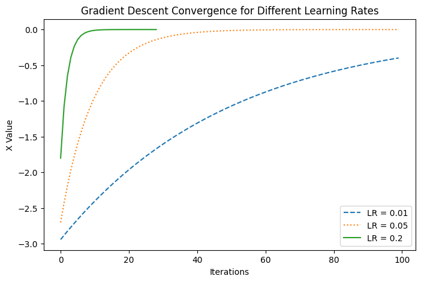

# Implementing Gradient Descent for Optimization

## Overview
This project focuses on implementing **Gradient Descent**, an optimization algorithm widely used in Machine Learning to minimize a function. The goal is to understand how **different learning rates** affect the convergence speed and efficiency of the algorithm. 

By applying **Gradient Descent** on a simple quadratic function:

\[
f(x) = x^2
\]

we analyze its behavior with different **learning rates (α)** and observe the convergence trends.

## Tools & Technologies Used
For this project, I used the following tools and technologies:

- **Python**: Core programming language used for implementation
    - **NumPy**: For mathematical computations and handling numerical data
    - **Matplotlib & Seaborn**: Used for visualizing the convergence of the algorithm
- **Jupyter Notebook**: Served as the interactive environment for execution and debugging
- **VS Code (PowerShell Terminal)**: Used for executing Python scripts
- **Git & GitHub**: Essential for version control and project sharing

## Project Steps
**Step 1: Understanding Gradient Descent**

**Step 2: Implementing Gradient Descent in Python**

**Step 3: Experimenting with Different Learning Rates**

**Step 4: Visualizing Convergence Behavior**

### **Step 1: Understanding Gradient Descent**
**Objective:** Gain a theoretical understanding of Gradient Descent and its significance in optimization.

#### **Concepts Covered**
- Definition and working of **Gradient Descent**  
- Derivative-based optimization for minimizing a function  
- Importance of **learning rate (α)** and its impact on convergence  

#### **Insights**
Gradient Descent iteratively updates a parameter \(x\) to minimize a function by taking steps proportional to the negative of the gradient.

---

### **Step 2: Implementing Gradient Descent in Python**
**Objective:** Write a Python function to implement the Gradient Descent algorithm for \( f(x) = x^2 \).

#### **Code Implementation**
- Defined a function for **Gradient Descent** update rule:  
  \[
  x_{new} = x - \alpha \cdot df(x)
  \]
- Used different learning rates (**0.01, 0.05, 0.2**)  
- Implemented a **stopping condition** when the absolute change in \( x \) is less than \( 1e-6 \)  

#### **Insights**
A smaller learning rate results in slower convergence, while a larger learning rate can lead to instability.

---

### **Step 3: Experimenting with Different Learning Rates**
**Objective:** Analyze how the choice of learning rate affects the algorithm’s performance.

#### **Data Analysis**
- Ran the algorithm for **100 iterations**  
- Compared results for **learning rates (0.01, 0.05, 0.2)**  

#### **Results**
| Learning Rate (α) | Final Value of x | Iterations Required |
|------------------|-----------------|-------------------|
| **0.01**  | -0.3979 | 100  |
| **0.05**  | -0.000079 | 100  |
| **0.2**   | -0.0000018 | **29** |

#### **Insights**
- **LR = 0.01** → Converges slowly but steadily  
- **LR = 0.05** → Faster convergence but still takes 100 iterations  
- **LR = 0.2** → **Fastest convergence (29 iterations)** 🚀  

---

### **Step 4: Visualizing Convergence Behavior**
**Objective:** Plot the stepwise movement of \( x \) towards the minimum using **Matplotlib**.

#### **Data Visualization**
```python
import numpy as np
import matplotlib.pyplot as plt

x_values = np.linspace(-2, 2, 100)
y_values = x_values ** 2

plt.plot(x_values, y_values, label="f(x) = x^2")
plt.scatter(x_history, y_history, color='red', marker='o', label="Gradient Descent Path")
plt.title("Gradient Descent Convergence")
plt.xlabel("x")
plt.ylabel("f(x)")
plt.legend()
plt.show()
```

### Result
                                                      *A clear visualization of how different learning rates affect the convergence speed*

- **Small α** → slow, stable descent
- **Large α** → faster convergence, but potential overshooting

## Documentation & Future Enhancements

**Detailed steps can be found in [`gradient_descent.ipynb`](gradient_descent.ipynb)**

#### Future Enhancements:
- Apply Gradient Descent to more complex functions (e.g., cubic, exponential functions)
- Implement Stochastic Gradient Descent (SGD) for datasets
- Test adaptive learning rates (Adam, RMSprop, etc.)
- Extend this to machine learning applications (e.g., Linear Regression)

## Conclusion
This project demonstrates how Gradient Descent works as an optimization technique. By experimenting with different learning rates, we observed:

1. The trade-off between **convergence speed** and **stability**
2. The importance of choosing an optimal **learning rate** to balance speed and accuracy
3. How **visualizing convergence** helps understand the algorithm’s behavior

Future work can extend this project to real-world **Machine Learning** applications like **Linear Regression** and **Neural Networks**.